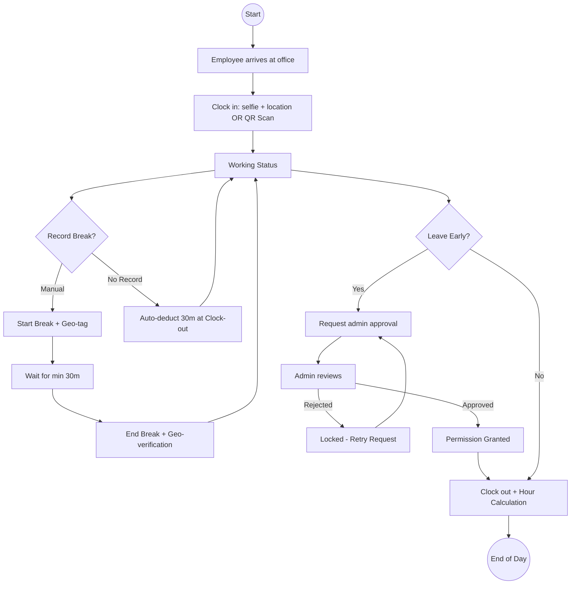
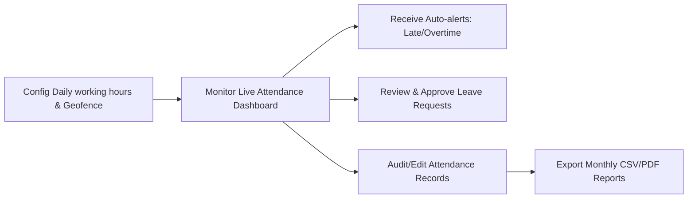
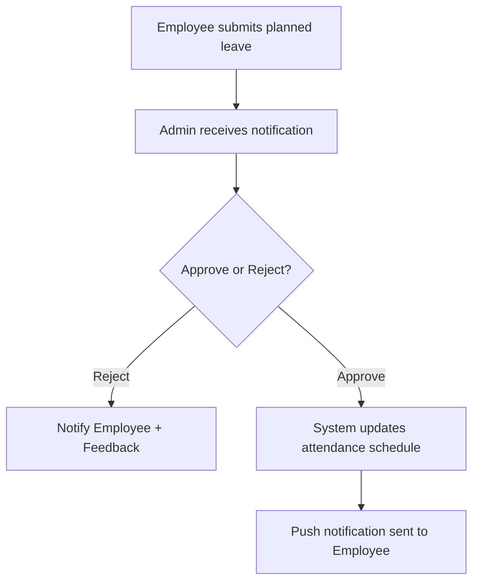

# LMS (Leave & Attendance Management System) - Comprehensive User Guide
> **Version 1.1** | **Last Updated: May 2026**
---

## 1. Executive Summary & Architecture

The LMS (Leave & Attendance Management System) is a premium workforce synchronization platform designed to manage attendance, enforce strict break rules, maintain a continuous time bank ledger, and monitor security boundaries (geofencing and device authorization) for both administrators and employees.

### Core Architectural Pillars
*   **Verification Protocols**: Captures check-ins via geofenced office QR beacons or base64 facial validation selfies.
*   **Time Bank Ledger**: Continuous, non-resetting time bank that registers overtime (credits) and short hours (debits), proportional to contract percentages.
*   **Break Infrastructure**: Auto-deduction rules if break timers are missed, ensuring fair shift calculations.
*   **Device Authorization**: Anti-tampering tracking that flags attendance from unrecognized employee devices and requests administrator override approval.

---

## 2. Platform Authentication

Accessing the LMS starts with role-based sign-in. Employee and Admin profiles share a secure gateway.

### Login Steps
1. Launch the **Workforce LMS** mobile app.
2. Input your **Employee ID** or registered Email.
3. Enter your **Password**.
4. Tap **Sign In**.

---

## 3. Employee Operational Workflow

This section outlines the workday cycle for an employee—from site arrival, clock-in verification, lunch break management, and time-bank tracking to clock-out validation.

### 3.1 Workday Flow Lifecycle

The diagram below details the employee experience from the start of the shift to final termination:

### 3.2 Verification Options
*   **QR Mode**: Scan the physical **QR Station Hub** located inside the office bounds. Requires location permission to verify radius.
*   **Selfie Mode**: Tap **Clock In Now** and capture an identity selfie. Base64 telemetry verifies credentials and records entry.

### 3.3 Lunch & Break Rules
*   **Mandatory Break**: A lunch break is mandatory and unpaid.
*   **Manual Breaks**: Initiating a manual break pauses the active work countdown timer. The minimum duration is **30 minutes**.
*   **Auto-Deduction**: If no manual break is logged during the shift, the system **automatically deducts 30 minutes** from the total working time during clock-out calculations.
*   **Geofencing**: Starting or ending breaks is geofenced. You must remain within the allowed workplace radius.

### 3.4 Time Bank Ledger
*   The **Time Bank** is a continuous account tracking extra hours worked (Credits) and short hours (Debits).
*   Balances carry forward up to **1 year** for payout settlements or days off in lieu.
*   The **Contract Percentage** (e.g., 100% full-time, 50% part-time) adjusts daily target hours proportionally:
    *   *Full-time target*: 8 hours 13 minutes (493 minutes).
    *   *50% part-time target*: 4 hours 7 minutes (247 minutes).

---

## 4. Admin Management & Configuration

Administrators oversee operations, define policies, correct errors, and handle security audits.

### 4.1 Admin Operations Architecture

The following map outlines the actions available on the administrator dashboard:

### 4.2 Executive Command Center
The Admin Dashboard gives a high-level overview of workforce status:
*   **Staff Count**: Total active employees.
*   **Attendance Health**: Real-time percentage of present workforce.
*   **Leave Requests**: Number of pending planned/emergency leave requests awaiting action.
*   **Activity Timeline**: Real-time logs of check-ins, break starts, and safety alerts.

### 4.3 Manual Attendance Correction
If an employee fails to check in/out (e.g., lost phone, network issue), admins can manually override records:
1. Open **Manual Attendance**.
2. Select the **Employee** and the target **Date**.
3. Input **Clock In** and **Clock Out** times.
4. Input **Lunch/Break Minutes** (defaults to 30 minutes if blank).
5. Add an optional **Reason** and click **Submit**. The system automatically re-evaluates worked minutes and adjusts the employee's Time Bank balance.

### 4.4 Security: Device Authorization
*   **Device Pinning**: To prevent buddy-punching, an employee's first attendance log pins that device’s UUID (`deviceId`) as their primary hardware.
*   **Mismatch Alerts**: Attendance logged from any other device triggers an admin alert on the dashboard.
*   **Admin Override**: The administrator can review device telemetry and tap **Register Device as Primary** to authorize the new device.

### 4.5 Work Policy Configurations
Admins define core policies matching local labor contracts:
*   **Shift Start & Grace Time**: Grace minutes before marking clock-in as late.
*   **Earliest Clock-out**: Prevents employees from terminating their shifts early without approval.
*   **Overtime Grace**: Period after shift end before overtime starts accruing (e.g., 60 minutes).
*   **Office Coordinates**: Geofence center point and radius (in meters) for verification.

---

## 5. Planned Leave Lifecycle

Employees can request planned leaves (Vacation, Sick Leave, Comp Off) in advance.

---

## 6. PDF/Print Report Generation

From the Employee detail overview, admins can export official evidence logs:
*   **PDF Export**: Formulates a clean document containing worked days, overtime totals, lunch breaks, and Time Bank balances.
*   **Evidence Distribution**: Allows printing or sharing via default platform interfaces.

---

## 7. Troubleshooting Checklist

### Employee Check-in Fails
*   **Geofence Error**: Verify that the GPS toggle is active on your mobile device and that you are within the registered radius of the office location.
*   **QR Scanner Error**: Ensure adequate lighting to read the office beacon QR.
*   **Camera Permission**: Grant camera access to let the app capture verification selfies.
*   **Shift Lock**: Ensure you are checking in within the allowed shift window configuration.

### Short Hours recorded
*   **Early Exit**: Terminating your shift before the daily target hours will log debits.
*   **Lunch break adjustment**: Ensure break minutes are logged accurately to prevent unintended auto-deductions.
