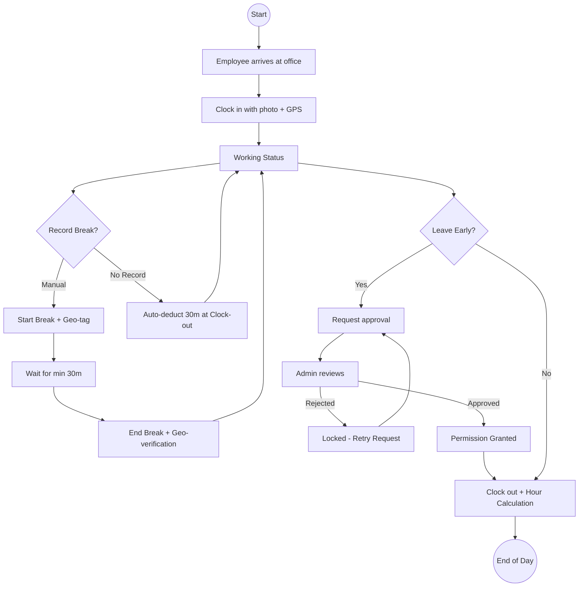
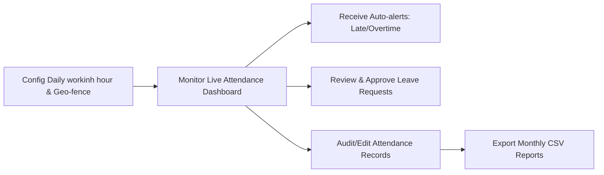
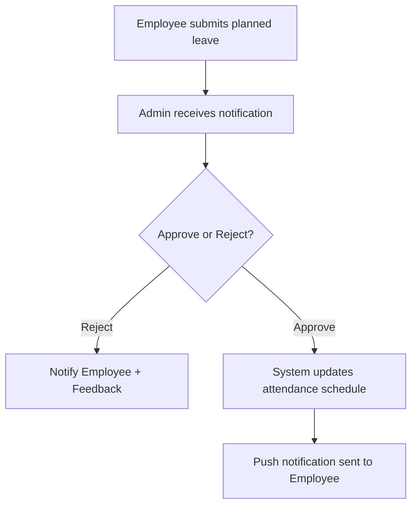

# LMS Project Operational Workflow
> **Client Preview Version** | Attendance, Leave, and Admin Oversight

---

## 1. Employee Workday Flow (with Lunch Logic)
This diagram captures the employee experience from arrival through clock-in, managing lunch breaks, requesting emergency leave if needed, and final clock-out.

### Key Logic Highlights:
*   **Lunch Deduction**: To simplify administration, if no break is manually logged, the system automatically deducts **30 minutes** from the total working time.
*   **Security**: All clock-in/out and break events are geo-fenced and verified against the registered workplace coordinates.

---

## 2. Admin Management & Oversight
While employees focus on their logs, the Admin maintains system health through configuration, real-time monitoring, and proactive auditing.

---

## 3. Planned Leave Lifecycle
Employees can request planned leaves (Vacation, Sick Leave, etc.) in advance. This process ensures the admin can manage workforce availability before the workday begins.

---
*&copy; 2026 LMS Platform Documentation. Generated for Client Review.*

Connect your project to Expo
Run the following command connect your project to Expo. This allows you to use our services:
npx eas-cli@latest init --id 2154ce41-8afe-4b47-9c4b-096871b23a61

Build and submit to the app stores
Run the following command to create Android and iOS builds, then submit them to the app stores.

npx eas-cli@latest build --platform all --auto-submit